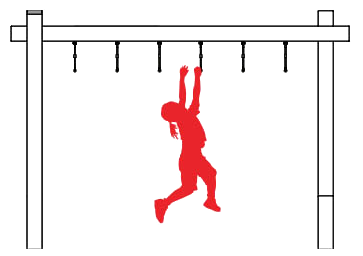

odkaz na mapu: https://mapy.com/en/turisticka?vlastni-body&ut=Chvilka%20filosofie&ut=Být%20či%20nebýt&ut=Nová%20Holka&ut=Rubikon&ut=Ve%20zdravém%20těle%20zdravý%20duch&ut=Mauglí&ut=U%20řek%20babylonských%20jsme%20sedávali&ut=Mind%20Meld&ut=Piš%20barde%20skládej&ut=Polyfémos&uc=9g.f1xXj4f5RyxXsHr3rD3ok5sGgon3x1e9zgPLdq3erleOkgwXDehjAgrq3oVkW0&ud=U%20pražských%20lomů%2C%20Prague%2C%20Prague&ud=50°4%2714.204"N%2C%2014°25%2729.390"E&ud=50°3%2752.375"N%2C%2014°24%2746.456"E&ud=50°4%270.215"N%2C%2014°25%2742.736"E&ud=Vyšehradské%20sady%2C%20Prague%2C%20Prague&ud=50°3%2717.813"N%2C%2014°25%278.038"E&ud=Dvorecký%20most%2C%20Prague%2C%20Prague&ud=50°2%2759.165"N%2C%2014°25%273.454"E&ud=Na%20Klaudiánce%20670%2F17%2C%20Prague%2C%20147%2000%2C%20Prague&ud=50°4%271.089"N%2C%2014°24%2753.080"E&x=14.4165656&y=50.0653498&z=15

## Chvilka filosofie
- spodek schodů u Braníka

Něco skrýváme před cizinci, něco před přáteli a něco i sami před sebou. Co předstíráte, že o sobě nevíte?

Otázka je těžká, proto vezměte co největší kámen a vyneste ho až na vrcholek schodů, kámen pak vyfoťte a pošlete do skupiny.

5 bodů + 5, pokud byl váš kámen největší

## Rubicon

**A:** Neoženíš se, jsi-li trochu při smyslech, a nezanecháš tohoto svého žití. Neboť já, jenž k tobě mluvím, oženil jsem se — proto ti radím: neber si ženu!
 
**B:** Věc je rozhodnuta a usnesena. Ať jsou kostky vrženy!
 
**A:** Nuž dobrá, jdi. Však dej ti nebe vyjít z toho zdráv.
Na pravé moře nesnází se nyní vydáváš —
ne libyjské, ne egejské, ni sicilské,
kde ze třiceti lodí tři se zachrání —
žádný ženatý muž nebyl nikdy zachráněn!
 
Menandros 342/41 – c. 290 BC

Caesar sice jen cituje Menandra, ale **alea iacta est**, je čas překročit Rubicon, nebo spíše Botičský potok. Vyberte mezi sebou Caesara, ten musí suchou nohou překročit potok, nesmí to však udělat po mostě. Fotky jsou vítány.

10 bodů

## Ve zdravém těle zdravý duch
- frisbee loučka
- poznámka: tato karta je časově zamčena je možné ji splnit jen v určitý moment, pokud klikne na tuto kartu uživatel dříve, tak ho jen upozorní, že kartu lze plnit až ve 20:00

Ve zdravém těle zdravý lapiduch, ale rozumné sportování také nemůže být na škodu. Zahrajte si s ostatními týmy frisbee na 3 body. Týmy, které vyhrají, získávají 15 bodů, ostatní 7. Pokud přijde týmů licho, jeden se bude muset rozdělit a získá tak 10 bodů.

## Být či nebýt
- amfiteátr

Být či nebýt TO je oč tu běží. Nahrajte monolog Hamleta, prince dánského v tomto malém amfiteátru. Na konci pak otočte kameru na jásavé publikum.
(Nebojte se použít telefonu coby lebky, monolog je to delší)

Být nebo nebýt – to je otázka:
je důstojnější zapřít se a snášet
surovost osudu a jeho rány,
anebo se vzepřít moři trápení
a skoncovat to navždy?

Zemřít, spát – a je to.
Spát – a navždy ukončit úzkost
a věčné útrapy a strázně,
co údělem jsou těla –
co si můžeme přát víc,
po čem toužit?

– Zemřít, spát – spát, možná snít –
a právě v tom je zrada.
Až ztichne vřava pozemského bytí,
ve spánku smrti můžeme mít sny –
to proto váháme a snášíme
tu dlouhou bídu,
již se říká život.

Neboť kdo vydržel by kopance
a výsměch doby,
aroganci mocných, průtahy soudů,
znesvěcenou lásku, nadutost úřadů
a ústrky, co slušnost věčně sklízí
od lumpů,
když pouhá dýka srovnala by účty,
a byl by klid?

Kdo chtěl by nést to břímě,
úpět a plahočit se životem,
nemít strach z toho, co je za smrtí,
z neznámé krajiny,
z níž poutníci se nevracejí.

To nám láme vůli – snášíme radši
hrůzy, které známe,
než abychom šli vstříc těm neznámým.

Tak svědomí z nás dělá zbabělce
a zdravá barva rozhodného činu
se roznemůže zbledlou meditací,
záměry velké významem a vahou
se odvracejí z vytčeného směru
a neuzrají v čin.

10 bodů

## Císařský ostrov
- je potřeba mít zde další tlačítko, které pokud zmáčknou, zjistí se jejich poloha a pokud jsou dostatečně blízko, tak získají 10 bodů. Pokud ne, napiš jim hlášku "Víc na sever/východ/západ/jih!". Po úspěchu pak získají 10 bodů.
- v legendě je yt video, způsob, aby tam byl yt přehrávač a mohli si ho přehrát  

https://www.youtube.com/watch?v=GegCCMBsbqo

Císařství padlo, nebo alespoň to Rakouské, takže bohužel za to nedostáváte žádné body. Ale mohli byste na tomhle ostrově nějaké přeci jen najít. Zámořský císař je přece stálý, vždyť smrt samotnou porazil už dávno. Sever! Narnie!

10 bodů

## Mind meld
- asi kdekoliv

https://www.youtube.com/watch?v=es7Br9kJBbo
Apollo-Soyuz Docking: July 17, 1975

Apollo-Soyuz jednoduchým podáním ruky propojilo dva téměř neslučitelné světy. Proto vy určete dvojici a propojte svoje mozky – oba pak vyřkněte bez předchozí domluvy náhodné slovo, pokud se shodují (počítají se i synonyma), vyhráváte, jinak se pokuste nezávisle vymyslet slovo, které je mezi těmi předchozími dvěma. Slova se nesmí nikdy opakovat a v mezičase nesmíte naznačovat, co bude vaše další slovo.

5 bodů

## Mauglí
- nějaká jungle gym

Džunglí Zákon, který nikdy ničeho nenařizuje bez důvodu, zapovídá všeliké zvěři jisti Člověka, vyjma ukazuje-li svým dětem, kterak zabíjet – a pak musí loviti mimo hranice lovišť své smečky nebo svého kmene. Pravým důvodem toho jest, že zabiti člověka znamená dříve či později příchod bílých lidí na slonech, s ručnicemi a sty hnědých mužů s gongy a raketami a pochodněmi. A pak trpí v džungli kde kdo. Avšak zvěř sama mezi sebou udává za důvod tohoto zákona, že je Člověk nejslabším a nejbezbrannějším ze všech živých tvorů, a že není důstojno sportovníka dotknouti.
 
Rudyard Kipling,
Kniha džunglí

Připravte se do džungle. Přeručkujte 20× opičí hrazdy tohohle hřiště (není potřeba, aby všichni přeručkovali stejně často).

5 bodů

## Piš barde skládej
- kdekoliv

PTÁČEK: No jo, to je on. Ale že já bych po něm pojmenoval důl? To je nesmysl! Ledaže by ho ode mne koupil. Ale že by mu ty básničky tak vynášely? Možné to je. Když bude mít dost peněz, klidně mu ho prodám. Piš, barde, střádej, a až budeš mít dvacet miliónů, přijde den, zúčtujem spolu.
 
Posel světla, Jára Cimrman

Vyberte si písničku, která má alespoň tři sloky a přepište ji do textboxu níže. Za každé slovo špatně ztrácíte jeden bod. Během plnění úkolu nedohledávejte text vámi zvolené písně.

10 bodů

poznámka: add three textboxes to this task so they can write the song in it and another one where they should input their team names in and another one for the name of the song and a button that will send the text to the email plhacko@gmail.com and a subject

## U řek babylonských jsme sedávali
- někde u řeky

1Mezi babylonskými řekami,
tam jsme sedávali a plakali,
když jsme vzpomínali na Sion.
2V té zemi jsme odložili citery
a zavěsili je na vrby.
3Naši věznitelé nás tam žádali,
abychom jim prý zpívali;
naši tyrani od nás chtěli veselí:
„Co kdybyste nám zpívali
některou z písní sionských?!“
4Jak bychom ale byli zpívali
Hospodinovu píseň mezi cizinci?
5Pokud zapomenu, Jeruzaléme, na tebe,
pak ať mi uschne pravice!
6Ať mi i k patru jazyk přiroste,
pokud přestanu myslet na tebe,
pokud mi Jeruzalém nebude nade vše,
nade všechny mé rozkoše!
7Hospodine, jen se rozpomeň
na Edomce v Jeruzalémě v onen den,
kdy vykřikovali: „Rozbořte, rozbořte,
zničte to město v základech!“
8Ó dcero Babylonská,
budeš zničena!
Blaze tomu, kdo ti odplatí
za všechna naše příkoří!
9Blaze tomu, kdo tvé děti uchopí
a o skálu je rozrazí!
 
Žalm 137, B21

Vyplňte následující kvíz:

### Otázka: Kolik párů ovcí vzal Noe do archy?
a) 1
b) 2
c) 7

Odpověď: c) 7 - Ovce jsou čistá zvířata, takže Noe vzal 7 párů zatímco vepřů jako nečistých zvířat vzal jen jeden pár

### Otázka: Kdo byl osvobozen andělem ze žaláře ve Skutcích 12?

a) Pavel
b) Petr
c) Barnabáš

Odpověď: b) Petr

### Otázka: Kdo jako první uviděl vzkříšeného Ježíše?

a) Petr
b) Marie Magdaléna
c) Jan

Odpověď: b) Marie Magdaléna ráno u hrobu

### Otázka: Která kniha Nového zákona byla napsána jako první?

a) Evangelium podle Matouše
b) Skutky apoštolů
c) 1. list Tesalonickým

Odpověď: c) 1. list Tesalonickým — napsán Pavlem kolem roku 50–51 n. l., zatímco evangelia a Skutky vznikly až v 60.–90. letech.

### Otázka: Co je podle jednoho z žalmů lepší než zapomenout na Jeruzalém?
a) Aby mu bylo vyloupnuto oko a uťata pravice
b) Zemřít v babylonském zajetí
c) Aby mu uschla pravice a jazyk přirostl k patru

Odpověď: c) — viz verše 5–6 žalmu výše

2 body za každou správnou odpověď

## Polyfémos
- kdekoliv

Druzi ten z olivy kyj pak chopili, na konci ostrý,
jemu jej do oka vbodli, já točil jím, svrchu oň opřen.
 Jako když lodní trám kdos vrtá, nebozez vezma,
při čemž druhové jeho jím vespod za řemen točí,
s obou jej chopíce stran — ten točí se stále a stále,
tak tím řeřavým kyjem jsme točili v obrově oku,
okolo něho pak krev, jak točil se, kroužila horká.
(...)
Zařval bolestí strašně, až kolem ječela skála.
Hrůzou jsme skočili zpět, však Kyklóps ze svého oka
vytrhl prudce ten kyj, jenž hojnou krví byl zbrocen,
pryč jím od sebe mrštil, a mávaje rukama divě,
křičel a Kyklopy volal, co kolem jeskyně jeho
po kopcích šlehaných větry svá bydliště ve slujích měli.
 Ti tedy slyšíce křik, hned se stran se sbíhali různých,
k jeho se stavěli sluji a ptali se, cože ho souží:
‚Čímpak jsi, Polyféme, tak postižen, že jsi tak vzkřikl
za doby božské noci, a proč nás ze spánku budíš?
Někdo-li z lidí ti brav tam vyhání proti tvé vůli,
nebo tě samého lstí tam vraždí — či by snad silou?‘
 Mohutný Polyfémos jim z jeskyně odvětil takto:
‚Přátelé, Nikdo mě lstí, však dokonce nevraždí silou.‘
 V odpověď Kyklopové mu pravili perutná slova:
‚Sám-li jsi ve své sluji a Nikdo ti nedělá křivdy,
nemoci velkého Dia se nijak vyhnouti nelze —
otce však modlitbou svou hleď vzývati, Poseidona!‘

Odysseus, který se Polyfémovi představil jako Nikdo, vás oslepil. Vyberte jednoho člena a ostatním zavažte oči (nebo je jiným způsobem nakrátko oslepte). Vidět pak můžete, až když dojdete na další stanoviště.

7 bodů

## Neplecha ukončena
- fara 
- tento úkol je úkol, který ukončí herní dobu - objeví se ve 20:45
- bude to speciální karta, která bude na sobě mít napsané Neplecha bude ukončena v 21:00
- po 21:00
    - změní se text úkolu na "Neplecha ukončena, zbývá už jen jeden poslední úkol a pak už jen vavříny pro vítěze." a bude tam tlačítko, které přepne mapu na kompas, kde bude přidána lokace tohoto stanoviště (a ostatní stanoviště budou hidden (stejně jako by uživatel zmáčknul nějakou z bublin pod kompasem))
    - úkoly na kartách už nebude možné splnit and zrušit jejich splnění (jinak funkcionalita zůstává stejná)
- místem bude umístěna uprostřed nad ostatními kartami
- tato karta by měla být barevně jako uno karta pro změnu barvy

Děkujeme za hraní!
Získali jste XX bodů a k tomu potenciálně až XX bonusových bodů
tohle je konec hry na vyhodnocení počkejtena zahradě fary, až se vrátí všechny týmy.
0 bodů

10
